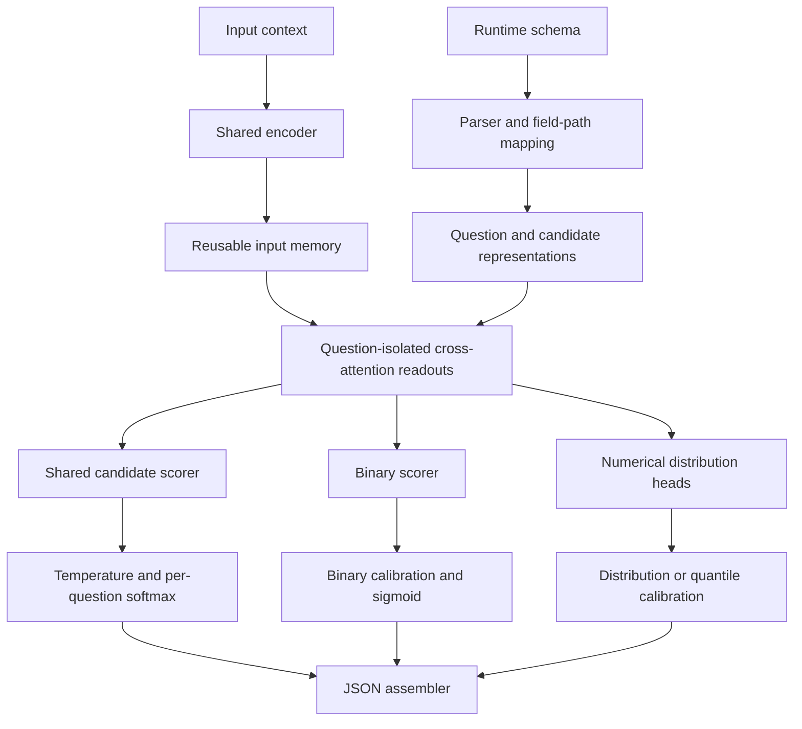

# Experiment plan

All experiments below are proposed, not completed. Links and supporting papers are indexed in [references](references.md).

## Sequence

1. Choose target tasks, deployment population, hardware, and numerical targets. Freeze definitions and data provenance.
2. Audit 200–500 generated field examples. Build the initial 5–10-family data pilot described in [training-data](training-data.md). The suggested 10,000 contexts is a planning target, not a calibration sample-size guarantee.
3. Freeze source-separated development, calibration, and final test partitions. Include unseen-schema families and realistic class prevalence.
4. Compare an untuned candidate-token scorer, Nimble-style LoRA candidate scoring, and GLiClass/GLiNER2. Restrict comparison to their common supported task types. Do not fabricate numerical capabilities for classification/extraction baselines.
5. Compare real-only supervision, schema augmentation, and added contrastive synthetic supervision. Use the same evaluation sets and report source counts separately from augmented field counts.
6. Fit held-out calibrators after freezing each model. Choose complexity on development data, then assess the untouched final test once the recipe is selected.
7. Sweep input length, field count, candidate count, and chunk size. Report backend, hardware, precision, warm/cold conditions, concurrency, latency percentiles, throughput, and peak memory. Single-field timing is not evidence of large-schema parallel speed.
8. Add isolated readouts or continuous numerical heads only when measured gaps justify the change.

## GLiNER2 baseline

Detailed execution protocol: [GLiNER2 benchmark and calibration](gliner2-benchmark.md), including score capture, split allocation, calibration arms, uncertainty, transfer tests, and proposed decision gates.

Parallel diagnostic: [Monte Carlo calibration study](monte-carlo-calibration.md) tests known event probabilities, choice/boolean agreement, multiple distributions, and calibrator robustness under controlled distortions and shift.

Include the [Fastino GLiNER2 repository](https://github.com/fastino-ai/GLiNER2) as an explicit implementation baseline. Its documented capabilities include schema-conditioned classification, entity extraction, structured records, and relations, with optional confidence scores. The repository now covers both GLiNER2 span models and GLiNER2.5 boundary models; keep these separate in results.

Proposed experiment:

1. Start with `fastino/gliner2-base-v1` (documented as 205M parameters, DeBERTa-v3-base). Pin the repository commit, package version, and checkpoint revision. Consider `fastino/gliner2-large-v1` as a later capacity comparison; treat GLiNER2.5 as a separate follow-up.
2. Run the pretrained checkpoint first, then a domain-fine-tuned variant using the same source-separated training data as the other baselines. Freeze schema descriptions on development data.
3. Compare categorical and boolean classification with GLiClass and Nimble on common tasks. Evaluate extraction separately with span/field F1 and exact-record accuracy. Extracting a number from text does not establish numerical forecasting support.
4. Check whether the pinned implementation exposes scores for every candidate needed for log loss, Brier score, and calibration. Record score semantics and any adapter work; returned confidence alone is not evidence of calibration.
5. Apply the existing schema/order/chunk stability tests and latency sweeps. Measure CPU and target-GPU performance separately, including preprocessing and decoding. Use local measurements to assess deployment fit.

Decision gate: retain GLiNER2 if it meets the predeclared quality, calibration, and deployment thresholds on supported tasks. Document unsupported fields and measured gaps before proposing custom heads.

## Proposed custom architecture

This is our proposed model, not verified Jev or Nimble internals. Nimble instead uses the pretrained LM output rows for candidate-token scoring; its shared prefix includes the schema. See [architecture](architecture.md) and [working brief](README.md).

## Measures and decision gates

- Classification: accuracy and per-class errors, log loss, Brier score, and reliability plots with uncertainty estimates.
- Numerical forecasts: appropriate proper scores, quantile/interval coverage, and sharpness. Specify units and horizon.
- Generalization: known vs unseen schemas, option counts, populations, and chronological holdouts.
- Stability: unchanged questions under field permutation, unrelated-field addition, and chunk changes. Distinguish numerical tolerance from semantic changes in shared schema input.
- Scaling: compare identical workloads; separately report MLX cache reuse and CUDA full-prompt work where applicable.
- Dataset quality: human-reviewed label errors, shortcut checks, duplicate/source overlap, annotation provenance, and cost per accepted example.

Set numerical pass/fail thresholds before inspecting final-test results; they are not yet agreed. Preserve checkpoint, tokenizer/template, scorer, calibrator, data hashes, seeds, dependency versions, and source commits for each run. Existing research URLs point to mutable branches; pin them at experiment setup.

## Value-function extension

Start with a frozen continuation policy and completed episodes. Train on Monte Carlo returns from prefixes, conditioned on goal, remaining budget/horizon, and action for a Q-function. Use executable alternative-action continuations where resettable environments permit. Keep whole episodes/tasks together when splitting.

A probability-of-success head represents value only under the specified binary terminal-reward objective without extra costs or discounting. General return objectives need numerical/distributional outputs. Score each action independently; do not softmax action values. Evaluate return error, action ranking against repeated rollouts, calibration under the target policy, and actual achieved policy return. Policy improvement can exploit optimistic errors and shifts the critic's input distribution. See the distributional RL and CQL sources in [references](references.md).

## Execution status

The original documentation task did not execute experiments. On 2026-09-19, a project-local Python/uv environment was installed and verified with an offline toy training/calibration smoke check; see [setup instructions](README.md#local-python-environment). No research model training, pretrained checkpoint download, API dataset generation, deployment, commit, push, or PR has been performed. The explicitly excluded harshatheg Qwen RLCD checkpoint remains recorded for provenance only.
